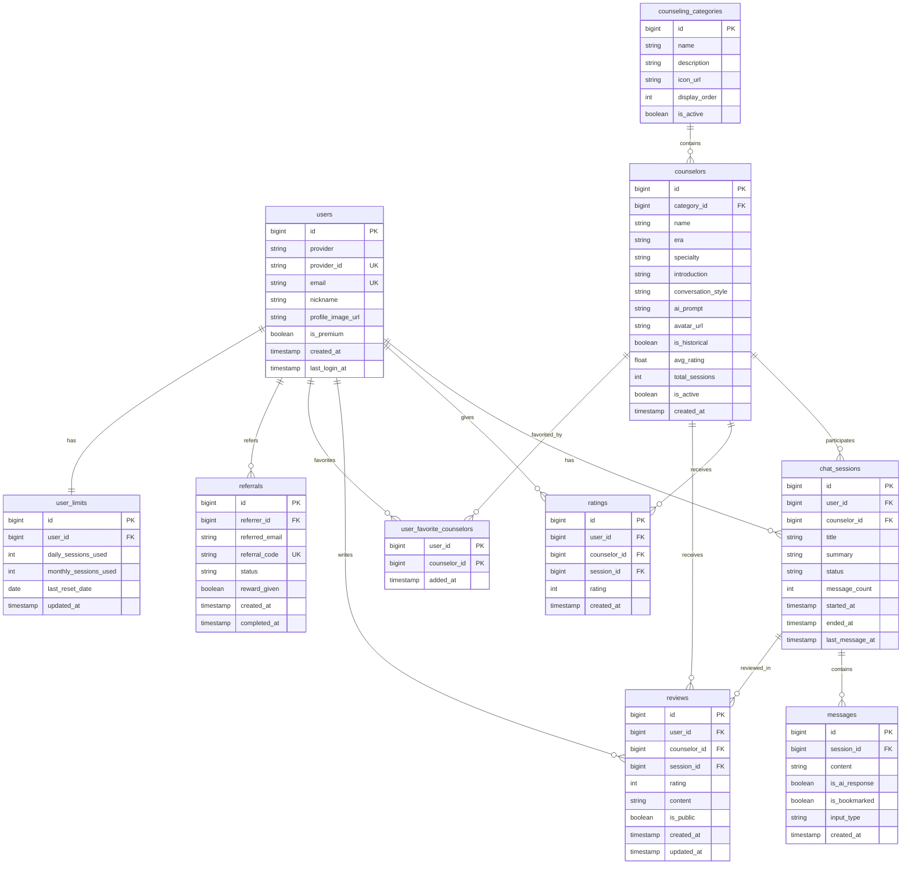

# ERD (Entity Relationship Diagram)

## 데이터베이스 스키마 설계



## 테이블 설명

### 👤 사용자 관련
- **users**: 소셜 로그인 사용자 정보
- **user_limits**: 무료 사용자 제한 (일일/월간)
- **referrals**: 친구 추천 관리

### 🎭 상담사 관련
- **counseling_categories**: 상담 카테고리 (육아, 연애 등)
- **counselors**: 철학자/상담사 정보
- **user_favorite_counselors**: 즐겨찾기 (다대다)

### 💬 대화 관련
- **chat_sessions**: 상담 세션
- **messages**: 메시지 (음성/텍스트 구분)

### ⭐ 평가 관련
- **ratings**: 간단 평점 (1-5점)
- **reviews**: 상세 후기

## 주요 비즈니스 로직

### 무료 사용자 제한
```sql
-- 일일 제한 체크
SELECT daily_sessions_used 
FROM user_limits 
WHERE user_id = ? 
  AND last_reset_date = CURRENT_DATE;

-- 월간 제한 체크  
SELECT monthly_sessions_used
FROM user_limits
WHERE user_id = ?
  AND MONTH(last_reset_date) = MONTH(CURRENT_DATE);
```

### 상담사 평점 업데이트
```sql
-- 평균 평점 계산 (트리거 or 스케줄러)
UPDATE counselors c
SET avg_rating = (
    SELECT AVG(rating) 
    FROM ratings r 
    WHERE r.counselor_id = c.id
);
```

### 세션 자동 종료
```sql
-- 30분 무응답 세션 종료
UPDATE chat_sessions
SET status = 'closed',
    ended_at = CURRENT_TIMESTAMP
WHERE status = 'active'
  AND last_message_at < DATE_SUB(NOW(), INTERVAL 30 MINUTE);
```

### 인기 상담사 조회
```sql
SELECT c.*, COUNT(cs.id) as session_count
FROM counselors c
LEFT JOIN chat_sessions cs ON c.id = cs.counselor_id
WHERE cs.started_at >= DATE_SUB(NOW(), INTERVAL 7 DAY)
GROUP BY c.id
ORDER BY session_count DESC, c.avg_rating DESC
LIMIT 10;
```

## 인덱스 전략

```sql
-- 자주 조회되는 컬럼
CREATE INDEX idx_sessions_user ON chat_sessions(user_id, status);
CREATE INDEX idx_sessions_counselor ON chat_sessions(counselor_id);
CREATE INDEX idx_messages_session ON messages(session_id);
CREATE INDEX idx_messages_bookmark ON messages(session_id, is_bookmarked);
CREATE INDEX idx_ratings_counselor ON ratings(counselor_id);
CREATE INDEX idx_reviews_counselor ON reviews(counselor_id, is_public);
CREATE INDEX idx_referrals_code ON referrals(referral_code);
```