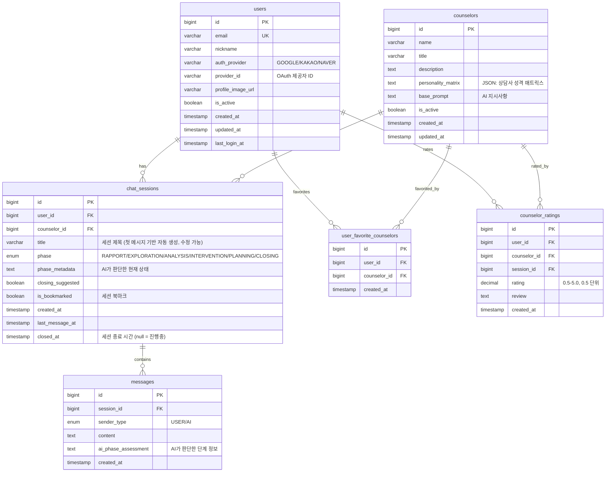

# ERD (Entity Relationship Diagram)

## 데이터베이스 스키마 설계



## 테이블 설명

### 1. users
- 사용자 정보 저장
- `auth_provider`: OAuth 제공자 (Google/Kakao/Naver)
- `provider_id`: OAuth 제공자가 주는 고유 ID
- `profile_image_url`: OAuth에서 가져온 프로필 이미지
- `is_active`: 계정 활성화 상태

### 2. counselors
- 상담사(AI 페르소나) 정보
- `personality_matrix`: 상담사 성격 특성 (JSON)
- `base_prompt`: AI에게 전달할 기본 지시사항
- 현대적 언어 사용, 단계별 상담 진행 지시 포함

### 3. chat_sessions
- 사용자와 상담사 간의 대화 세션
- `title`: 세션 제목 (첫 메시지 기반 자동 생성, 사용자 수정 가능)
- `phase`: AI가 자율적으로 판단하는 상담 단계
  - RAPPORT_BUILDING: 라포 형성
  - PROBLEM_EXPLORATION: 문제 탐색
  - PATTERN_ANALYSIS: 패턴 분석
  - INTERVENTION: 개입/해결
  - ACTION_PLANNING: 실행 계획
  - CLOSING: 마무리
- `phase_metadata`: AI의 현재 판단 상태
- `closing_suggested`: 마무리 제안 여부
- `is_bookmarked`: 사용자가 북마크한 세션

### 4. messages
- 개별 메시지 저장
- `ai_phase_assessment`: AI가 각 메시지마다 판단한 단계 정보
- `sender_type`: 메시지 발신자 (USER/AI)

### 5. user_favorite_counselors
- 사용자가 즐겨찾기한 상담사
- 빠른 접근을 위한 매핑 테이블

### 6. counselor_ratings
- 세션 종료 후 상담사 평가
- 매칭 알고리즘 개선에 활용

## 인덱스 전략

```sql
-- 자주 사용되는 조회를 위한 인덱스
CREATE INDEX idx_sessions_user_id ON chat_sessions(user_id);
CREATE INDEX idx_sessions_counselor_id ON chat_sessions(counselor_id);
CREATE INDEX idx_messages_session_id ON messages(session_id);
CREATE INDEX idx_messages_created_at ON messages(created_at);
CREATE INDEX idx_ratings_counselor_id ON counselor_ratings(counselor_id);
```

## 주요 변경사항

1. **OAuth 기반 인증**: Google/Kakao/Naver OAuth만 사용
2. **세션 북마크**: 개별 메시지가 아닌 세션 단위 북마크
3. **세션 요약 제거**: 과도한 기능 제거로 MVP 단순화
4. **사용자 선호도 제거**: preference_matrix 제거, AI 도우미가 추천
5. **심플한 구조**: 핵심 기능만 남기고 단순화