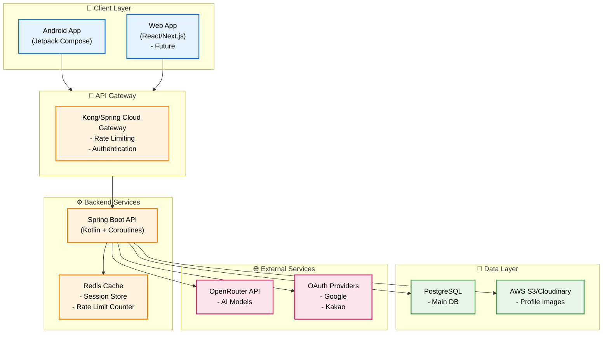
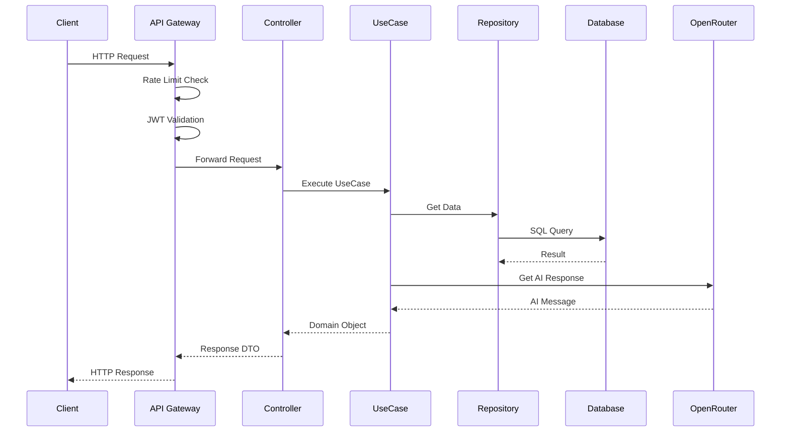

# 시스템 아키텍처

## 🏗️ 전체 아키텍처 (2025 Best Practice)



## 📦 Clean Architecture (Hexagonal)

```
src/main/kotlin/com/aicounseling/app/
├── 🎯 core/                    # 비즈니스 로직 (의존성 없음)
│   ├── domain/
│   │   ├── model/              # 도메인 엔티티
│   │   ├── repository/         # Repository 인터페이스
│   │   └── exception/          # 도메인 예외
│   └── usecase/                # 유스케이스 (비즈니스 규칙)
│
├── 🔌 adapter/                  # 외부 연결 어댑터
│   ├── in/                     # 인바운드 (들어오는 요청)
│   │   ├── web/               
│   │   │   ├── controller/    # REST Controllers
│   │   │   ├── dto/           # Request/Response DTO
│   │   │   └── mapper/        # DTO ↔ Domain 변환
│   │   └── websocket/          # WebSocket (실시간 채팅)
│   │
│   └── out/                    # 아웃바운드 (나가는 요청)
│       ├── persistence/
│       │   ├── entity/         # JPA Entity
│       │   ├── repository/     # JPA Repository 구현
│       │   └── mapper/         # Entity ↔ Domain 변환
│       ├── ai/                 # OpenRouter 연동
│       ├── auth/               # OAuth 연동
│       └── cache/              # Redis 연동
│
├── 🔧 config/                   # 설정
│   ├── SecurityConfig.kt
│   ├── WebConfig.kt
│   ├── OpenApiConfig.kt       # Swagger
│   └── AsyncConfig.kt          # Coroutine 설정
│
└── 🚀 Application.kt            # 메인 클래스
```

## 🔄 요청 흐름 (Request Flow)



## 🛠️ 기술 스택 (2025 Standard)

### Backend
- **Language**: Kotlin 2.0
- **Framework**: Spring Boot 3.5 + WebFlux
- **Async**: Coroutines + Flow
- **DB Access**: Spring Data JPA + QueryDSL
- **API Doc**: SpringDoc OpenAPI 3.0
- **Security**: Spring Security + JWT
- **Validation**: Jakarta Validation

### Infrastructure
- **Container**: Docker + Kubernetes
- **CI/CD**: GitHub Actions
- **Monitoring**: Prometheus + Grafana
- **Logging**: ELK Stack
- **APM**: OpenTelemetry

### Database
- **Main**: PostgreSQL 16
- **Cache**: Redis 7
- **Migration**: Flyway

### Testing
- **Unit**: JUnit 5 + MockK
- **Integration**: TestContainers
- **E2E**: RestAssured
- **Coverage**: Jacoco (목표 80%)

## 🚦 API 설계 원칙

### 1. RESTful API Design
```
GET    /api/v1/counselors          # 목록
GET    /api/v1/counselors/{id}     # 상세
POST   /api/v1/counselors          # 생성
PUT    /api/v1/counselors/{id}     # 수정
DELETE /api/v1/counselors/{id}     # 삭제
```

### 2. Response Format
```json
{
  "success": true,
  "data": { ... },
  "error": null,
  "timestamp": "2025-08-15T10:00:00Z"
}
```

### 3. Error Response
```json
{
  "success": false,
  "data": null,
  "error": {
    "code": "USER_NOT_FOUND",
    "message": "사용자를 찾을 수 없습니다",
    "details": { ... }
  },
  "timestamp": "2025-08-15T10:00:00Z"
}
```

## 🔐 보안 체크리스트

- [x] HTTPS only
- [x] JWT with refresh token
- [x] Rate limiting
- [x] SQL Injection 방지 (Prepared Statement)
- [x] XSS 방지 (Input Validation)
- [x] CORS 설정
- [x] API Key 환경변수
- [x] 민감정보 로깅 금지

## 📈 성능 최적화

### 1. Database
- Index 전략
- Query 최적화 (N+1 문제 해결)
- Connection Pool 튜닝

### 2. Caching
- Redis로 세션 관리
- 상담사 정보 캐싱
- CDN for static assets

### 3. Async Processing
- Coroutines for non-blocking
- WebFlux for reactive streams
- Message Queue (future)

## 🎯 개발 우선순위

### Phase 1: MVP (2주)
1. ✅ 요구사항 분석
2. ✅ DB 설계
3. ✅ API 설계
4. 🔄 Clean Architecture 셋업
5. ⏳ 도메인 모델 구현
6. ⏳ 핵심 API 구현 (인증, 상담사, 채팅)

### Phase 2: 안정화 (1주)
- 테스트 코드 작성
- 에러 처리 개선
- 로깅 & 모니터링

### Phase 3: 배포 (1주)
- Docker 컨테이너화
- CI/CD 파이프라인
- 운영 환경 배포