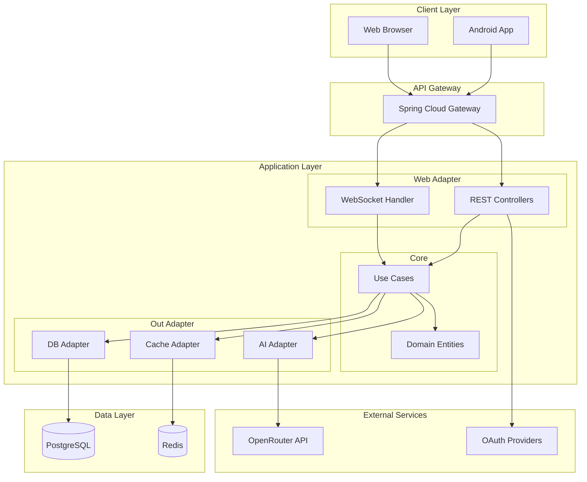
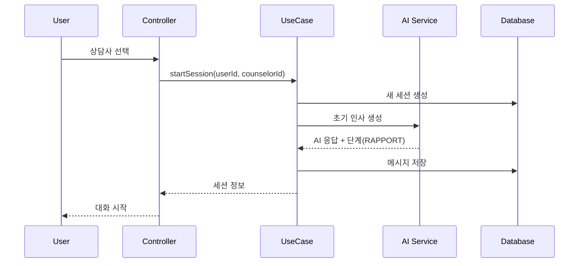
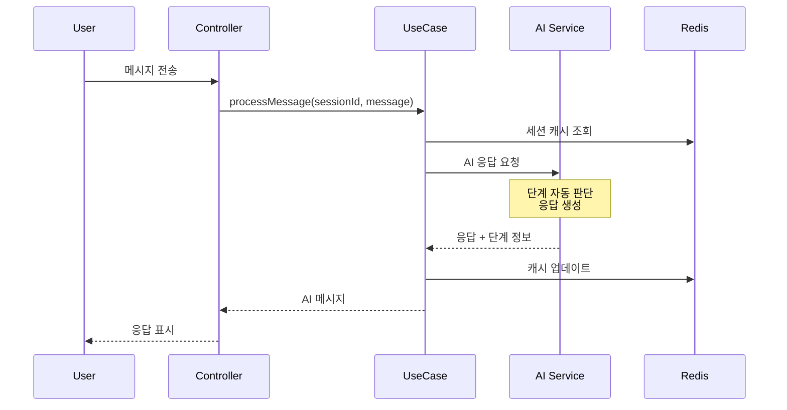

# 시스템 아키텍처

## 1. 아키텍처 개요



## 2. Clean Architecture 구조

```
com.aicounseling.app/
├── core/
│   ├── domain/              # 엔티티 (기술 독립적)
│   │   ├── User.kt
│   │   ├── Counselor.kt
│   │   ├── ChatSession.kt
│   │   ├── Message.kt
│   │   └── SessionSummary.kt
│   │
│   └── usecase/             # 비즈니스 로직
│       ├── auth/
│       ├── counselor/
│       │   ├── MatchCounselorUseCase.kt
│       │   └── GetCounselorListUseCase.kt
│       ├── session/
│       │   ├── StartSessionUseCase.kt
│       │   ├── ProcessMessageUseCase.kt
│       │   └── EndSessionUseCase.kt
│       └── ai/
│           ├── GenerateResponseUseCase.kt
│           └── AnalyzePhaseUseCase.kt
│
├── adapter/
│   ├── in/
│   │   └── web/             # REST API
│   │       ├── controller/
│   │       ├── dto/
│   │       └── mapper/
│   │
│   └── out/
│       ├── persistence/     # DB 접근
│       │   ├── repository/
│       │   └── entity/
│       ├── ai/             # OpenRouter 연동
│       │   ├── OpenRouterClient.kt
│       │   └── PromptBuilder.kt
│       └── cache/          # Redis
│           └── SessionCache.kt
│
└── config/                  # Spring 설정
    ├── SecurityConfig.kt
    ├── WebClientConfig.kt
    └── CacheConfig.kt
```

## 3. 핵심 컴포넌트

### 3.1 Domain Layer
- **User**: 사용자 정보 + 선호 매트릭스
- **Counselor**: 상담사 정보 + 성격 매트릭스
- **ChatSession**: 세션 정보 + AI 판단 단계
- **Message**: 개별 메시지
- **SessionSummary**: AI 생성 요약

### 3.2 Use Case Layer
```kotlin
// 메시지 처리 유스케이스
class ProcessMessageUseCase(
    private val sessionRepository: SessionRepository,
    private val messageRepository: MessageRepository,
    private val aiService: AIService
) {
    suspend fun execute(sessionId: Long, userMessage: String): Message {
        // 1. 현재 세션 조회
        val session = sessionRepository.findById(sessionId)
        
        // 2. AI 응답 생성 (단계 자동 판단 포함)
        val aiResponse = aiService.generateResponse(
            session = session,
            userMessage = userMessage
        )
        
        // 3. 단계 업데이트
        session.updatePhase(aiResponse.phaseAssessment)
        
        // 4. 메시지 저장
        return messageRepository.save(
            Message(
                sessionId = sessionId,
                content = aiResponse.response,
                aiPhaseAssessment = aiResponse.phaseAssessment
            )
        )
    }
}
```

### 3.3 AI Adapter
```kotlin
class OpenRouterClient(
    private val webClient: WebClient,
    private val promptBuilder: PromptBuilder
) {
    suspend fun chat(
        counselor: Counselor,
        messages: List<Message>,
        currentPhase: CounselingPhase
    ): AIResponse {
        // 프롬프트 생성 (AI 자율 판단 지시 포함)
        val prompt = promptBuilder.build(
            counselor = counselor,
            messages = messages,
            instructions = """
                대화 맥락을 보고 현재 단계를 판단하세요.
                사용자가 준비되면 자연스럽게 다음 단계로 전환.
                절대 "이제 분석 단계입니다" 같은 메타 발언 금지.
            """
        )
        
        // OpenRouter API 호출
        return webClient.post()
            .uri("https://openrouter.ai/api/v1/chat/completions")
            .bodyValue(ChatRequest(
                model = "liquid/lfm-40b",
                messages = prompt,
                maxTokens = 2000
            ))
            .retrieve()
            .bodyToMono<AIResponse>()
            .awaitSingle()
    }
}
```

## 4. 데이터 흐름

### 4.1 새 세션 시작


### 4.2 메시지 처리


## 5. AI 상담 단계 자동 진행

### 5.1 단계 정의
```kotlin
enum class CounselingPhase {
    RAPPORT_BUILDING,     // 라포 형성
    PROBLEM_EXPLORATION,  // 문제 탐색
    PATTERN_ANALYSIS,     // 패턴 분석
    INTERVENTION,         // 개입/해결
    ACTION_PLANNING,      // 실행 계획
    CLOSING              // 마무리
}
```

### 5.2 AI 자율 판단
- 고정 턴 수 없음
- 대화 맥락 기반 판단
- 사용자 준비도 감지
- 자연스러운 전환

## 6. 성능 최적화

### 6.1 캐싱 전략
- Redis: 활성 세션 캐싱
- 응답 시간 단축
- DB 부하 감소

### 6.2 비동기 처리
- WebFlux 비동기
- Coroutines 활용
- Non-blocking I/O

## 7. 보안

### 7.1 인증/인가
- JWT 토큰
- OAuth 2.0
- Spring Security

### 7.2 API 보안
- Rate Limiting
- API Key 관리
- HTTPS 필수

## 8. 확장성

### 8.1 수평 확장
- Stateless 설계
- 로드 밸런싱
- 세션 클러스터링

### 8.2 모니터링
- Prometheus (추후)
- Grafana (추후)
- ELK Stack (추후)