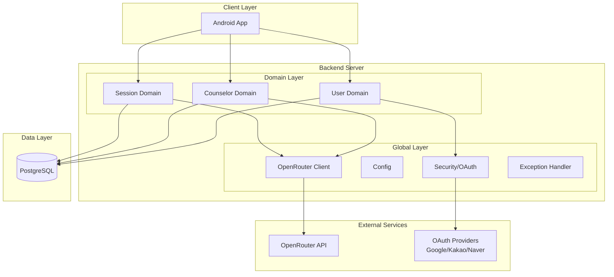
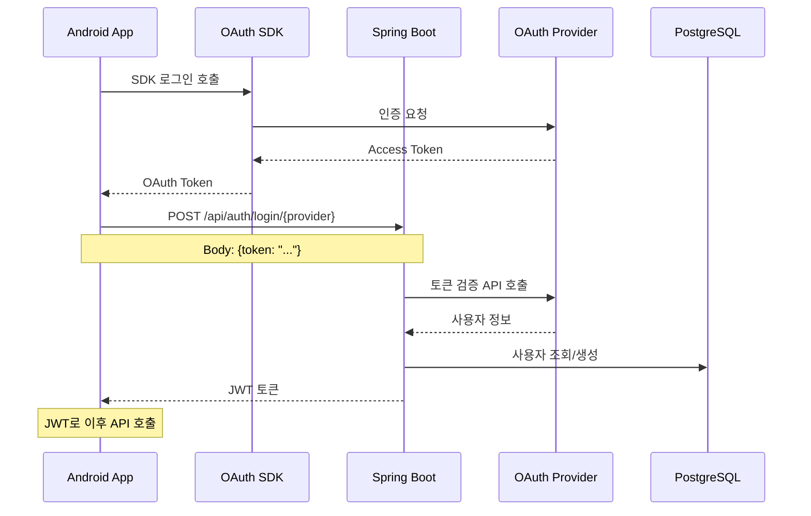
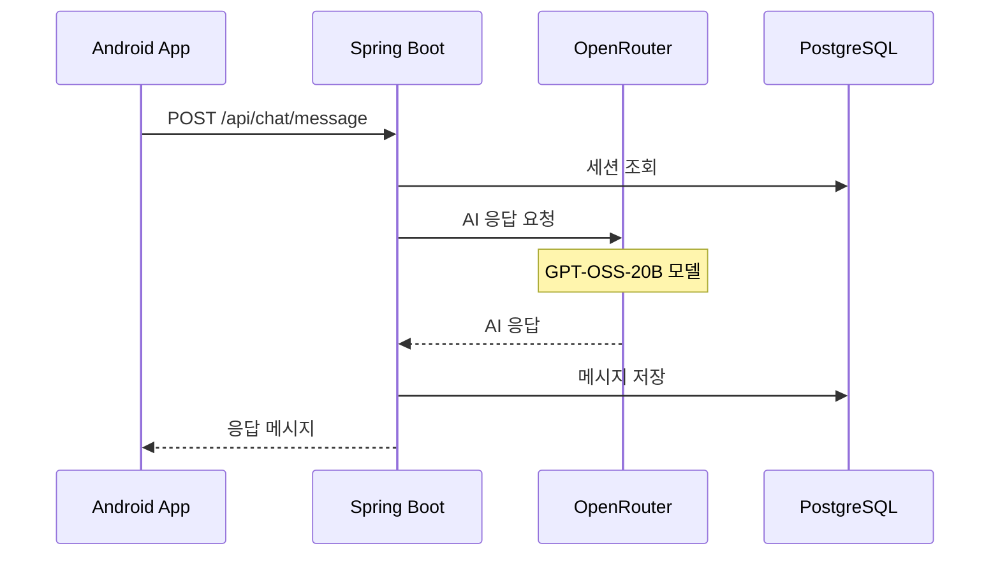

# 시스템 아키텍처

## 1. 아키텍처 개요



## 2. Feature-based 패키지 구조

```
com.aicounseling.app/
├── domain/                    # 기능별 패키지
│   ├── user/                 # 사용자 도메인
│   │   ├── User.kt          # 엔티티
│   │   ├── UserService.kt   # 서비스
│   │   ├── UserRepository.kt # 레포지토리
│   │   └── UserController.kt # 컨트롤러 (예정)
│   │
│   ├── counselor/           # 상담사 도메인
│   │   ├── Counselor.kt
│   │   ├── CounselorService.kt
│   │   └── CounselorRepository.kt
│   │
│   ├── session/            # 세션 도메인
│   │   ├── ChatSession.kt
│   │   ├── ChatSessionService.kt
│   │   ├── ChatSessionRepository.kt
│   │   └── CounselingPhase.kt
│   │
│   └── auth/               # 인증 도메인
│       ├── AuthController.kt
│       ├── AuthService.kt
│       └── OAuthTokenVerifier.kt
│
├── global/                  # 전역 설정/공통
│   ├── config/             # Spring 설정
│   ├── security/           # JWT, 필터
│   ├── exception/          # 전역 예외 처리
│   ├── openrouter/         # OpenRouter API 클라이언트
│   ├── jpa/                # BaseEntity
│   └── rsData/             # 응답 포맷
│
└── standard/
    └── util/               # 유틸리티
```

## 3. 핵심 컴포넌트

### 3.1 Domain Entities
- **User**: OAuth 사용자 정보
- **Counselor**: AI 상담사 정보 + 성격 매트릭스
- **ChatSession**: 상담 세션 + 진행 단계
- **Message**: 개별 메시지 (미구현)
- **SessionSummary**: AI 생성 요약 (미구현)

### 3.2 Service Layer
```kotlin
// UserService - OAuth 로그인 처리
@Service
@Transactional
class UserService(
    private val userRepository: UserRepository
) {
    fun processOAuthLogin(
        email: String, 
        nickname: String, 
        provider: AuthProvider
    ): User {
        // 기존 사용자 확인 또는 신규 생성
        return userRepository.findByEmailAndAuthProvider(email, provider)
            ?: createNewUser(email, nickname, provider)
    }
}

// CounselorService - 상담사 관리
@Service
class CounselorService(
    private val counselorRepository: CounselorRepository,
    private val sessionRepository: ChatSessionRepository
) {
    fun findActiveCounselors(): List<Counselor> {
        return counselorRepository.findByIsActiveTrue()
    }
    
    fun getCounselorWithStats(id: Long): Counselor {
        val counselor = counselorRepository.findById(id)
        counselor.totalSessions = sessionRepository.countByCounselorId(id)
        return counselor
    }
}
```

### 3.3 OpenRouter Integration
```kotlin
@Service
class OpenRouterService(
    private val webClient: WebClient,
    private val properties: OpenRouterProperties
) {
    suspend fun sendCounselingMessage(
        userMessage: String,
        counselorPrompt: String,
        conversationHistory: List<Message>
    ): String {
        val request = ChatRequest(
            model = "openai/gpt-oss-20b",
            messages = buildMessages(counselorPrompt, conversationHistory, userMessage),
            temperature = 0.7,
            max_tokens = 2000
        )
        
        return webClient.post()
            .uri("/chat/completions")
            .bodyValue(request)
            .retrieve()
            .bodyToMono(ChatResponse::class.java)
            .map { it.choices.first().message.content }
            .awaitSingle()
    }
}
```

## 4. 데이터 흐름

### 4.1 OAuth 로그인 플로우 (Android SDK 방식)


### 4.2 상담 메시지 처리


## 5. 상담 단계 (AI 자동 판단)

### 5.1 단계 정의
```kotlin
enum class CounselingPhase {
    RAPPORT_BUILDING,     // 라포 형성 - 인사, 편안한 분위기
    PROBLEM_EXPLORATION,  // 문제 탐색 - 구체적 상황 파악
    PATTERN_ANALYSIS,     // 패턴 분석 - 반복 패턴 파악
    INTERVENTION,         // 개입 - 대안 제시, 통찰
    ACTION_PLANNING,      // 실행 계획 - 구체적 행동
    CLOSING              // 마무리 - 요약, 격려
}
```

### 5.2 AI 자율 진행
- 고정된 턴 수 없음
- 대화 맥락 기반 자동 판단
- 자연스러운 단계 전환
- 메타 발언 금지

## 6. 데이터베이스 스키마

### 6.1 주요 테이블
```sql
-- users 테이블
CREATE TABLE users (
    id BIGSERIAL PRIMARY KEY,
    email VARCHAR(255) UNIQUE NOT NULL,
    nickname VARCHAR(100) NOT NULL,
    auth_provider VARCHAR(20) NOT NULL,
    provider_id VARCHAR(255),
    last_login_at TIMESTAMP,
    is_active BOOLEAN DEFAULT true,
    created_at TIMESTAMP DEFAULT CURRENT_TIMESTAMP
);

-- counselors 테이블
CREATE TABLE counselors (
    id BIGSERIAL PRIMARY KEY,
    name VARCHAR(50) NOT NULL,
    title VARCHAR(100) NOT NULL,
    description VARCHAR(500) NOT NULL,
    personality_matrix TEXT NOT NULL,  -- JSON
    base_prompt TEXT NOT NULL,
    is_active BOOLEAN DEFAULT true,
    created_at TIMESTAMP DEFAULT CURRENT_TIMESTAMP
);

-- chat_sessions 테이블
CREATE TABLE chat_sessions (
    id BIGSERIAL PRIMARY KEY,
    user_id BIGINT REFERENCES users(id),
    counselor_id BIGINT REFERENCES counselors(id),
    phase VARCHAR(50) NOT NULL,
    phase_metadata TEXT,
    created_at TIMESTAMP DEFAULT CURRENT_TIMESTAMP,
    closed_at TIMESTAMP
);
```

## 7. API 엔드포인트

### 7.1 인증 API
```http
POST /api/auth/login/google   # Google 토큰 검증 + JWT 발급
POST /api/auth/login/kakao    # Kakao 토큰 검증 + JWT 발급  
POST /api/auth/login/naver    # Naver 토큰 검증 + JWT 발급
POST /api/auth/refresh         # JWT 토큰 갱신 (예정)
POST /api/auth/logout          # 로그아웃 (예정)
```

### 7.2 사용자 API
```http
GET /api/users/me                   # 내 정보 조회
PATCH /api/users/nickname           # 닉네임 변경
```

### 7.3 상담사 API
```http
GET /api/counselors                 # 상담사 목록
GET /api/counselors/{id}            # 상담사 상세
GET /api/counselors/favorites       # 즐겨찾기 목록
POST /api/counselors/{id}/favorite  # 즐겨찾기 추가
DELETE /api/counselors/{id}/favorite # 즐겨찾기 제거
GET /api/counselors/{id}/ratings    # 평가 목록 조회
```

### 7.4 세션 API
```http
POST /api/sessions                  # 세션 시작 (상담 시작)
GET /api/sessions/{id}              # 세션 조회
POST /api/sessions/{id}/messages    # 메시지 전송
GET /api/sessions/{id}/messages     # 메시지 목록
POST /api/sessions/{id}/close       # 세션 종료
POST /api/sessions/{id}/rating      # 평가 남기기
```

## 8. 배포 아키텍처

### 8.1 개발 환경
```
Android Studio (에뮬레이터)
    ↓
localhost:8080 (Spring Boot)
    ↓
H2 In-Memory DB
```

### 8.2 운영 환경
```
Android App (Play Store)
    ↓
Railway/Render (Spring Boot)
    ↓
Supabase (PostgreSQL)
```

## 9. 보안

### 9.1 인증/인가
- OAuth2 소셜 로그인만 지원
- JWT 토큰 기반 인증
- Spring Security 설정

### 9.2 API 보안
- HTTPS 필수
- API Key 환경변수 관리
- Rate Limiting (추후)

## 10. 성능 최적화

### 10.1 현재 적용
- Spring WebFlux 비동기
- Kotlin Coroutines
- JPA 지연 로딩

### 10.2 추후 적용
- Redis 캐싱
- 응답 압축
- CDN (이미지/정적 파일)

## 11. 모니터링 (추후)

### 11.1 APM
- Spring Actuator
- Prometheus + Grafana

### 11.2 로깅
- Logback
- ELK Stack (추후)

## 12. 확장 계획

### Phase 1 (MVP)
- 기본 채팅 기능
- 3-5명 상담사
- OAuth 로그인

### Phase 2
- 메시지 북마크
- 세션 요약
- 상담사 평가

### Phase 3
- 실시간 알림
- 음성 상담
- 그룹 상담
