# 유스케이스 다이어그램

## AI 철학자/상담사 대화 시스템

```mermaid
graph TB
    %% 스타일 정의 (진한 색상으로 가독성 개선)
    classDef actor fill:#2196F3,stroke:#0D47A1,stroke-width:2px,color:#FFFFFF
    classDef usecase fill:#FF9800,stroke:#E65100,stroke-width:2px,color:#000000
    classDef system fill:#9C27B0,stroke:#4A148C,stroke-width:2px,color:#FFFFFF
    
    %% 액터
    User[👤 일반 사용자]:::actor
    AI[🤖 AI 시스템]:::actor  
    Admin[👨‍💼 관리자]:::actor
    
    %% 시스템 경계
    subgraph System[" AI 상담 시스템 "]
        %% 인증 관련
        UC1(회원가입):::usecase
        UC2(로그인):::usecase
        UC3(로그아웃):::usecase
        
        %% 상담사 선택
        UC4(상담 카테고리 조회):::usecase
        UC5(상담사 목록 조회):::usecase
        UC6(상담사 상세정보 보기):::usecase
        UC7(AI 가이드 상담):::usecase
        UC8(상담사 추천받기):::usecase
        UC9(상담사 즐겨찾기):::usecase
        
        %% 대화 관련
        UC10(새 상담 세션 시작):::usecase
        UC11(메시지 전송):::usecase
        UC12(AI 응답 받기):::usecase
        UC13(대화 히스토리 조회):::usecase
        UC14(중요 조언 북마크):::usecase
        UC15(북마크 목록 조회):::usecase
        
        %% 세션 관리
        UC16(내 상담 세션 목록):::usecase
        UC17(세션 요약 보기):::usecase
        UC18(세션 삭제):::usecase
        
        %% 관리자
        UC19(상담사 정보 관리):::usecase
        UC20(사용 통계 조회):::usecase
        UC21(AI 프롬프트 관리):::usecase
    end
    
    %% 사용자 연결
    User --> UC1
    User --> UC2
    User --> UC3
    User --> UC4
    User --> UC5
    User --> UC6
    User --> UC7
    User --> UC9
    User --> UC10
    User --> UC11
    User --> UC13
    User --> UC14
    User --> UC15
    User --> UC16
    User --> UC17
    User --> UC18
    
    %% AI 시스템 연결
    AI --> UC8
    AI --> UC12
    AI --> UC17
    
    %% 관리자 연결
    Admin --> UC19
    Admin --> UC20
    Admin --> UC21
    
    %% Include 관계 (점선)
    UC7 -.include.-> UC8
    UC10 -.include.-> UC5
    UC11 -.include.-> UC12
    
    %% Extend 관계 (점선)
    UC5 -.extend.-> UC6
    UC13 -.extend.-> UC14
    UC16 -.extend.-> UC17
```

## 주요 유스케이스 설명

### 🔐 인증 관련
- **회원가입**: 이메일, 닉네임으로 계정 생성
- **로그인**: JWT 토큰 기반 인증
- **로그아웃**: 세션 종료

### 🧭 상담사 선택
- **카테고리 조회**: 육아, 연애, 정신건강, 커리어 등
- **상담사 목록**: 카테고리별 철학자/상담사 리스트
- **AI 가이드**: "어떤 고민이신가요?" → 적합한 상담사 추천
- **즐겨찾기**: 자주 대화하는 상담사 저장

### 💬 대화 기능
- **세션 시작**: 선택한 상담사와 새 대화 시작
- **메시지 전송**: 사용자 고민 입력 → AI 응답 생성
- **히스토리**: 이전 대화 내용 확인
- **북마크**: 중요한 조언 저장

### 📊 세션 관리  
- **세션 목록**: 모든 상담 대화 목록
- **세션 요약**: AI가 생성한 대화 요약
- **세션 삭제**: 불필요한 대화 삭제

### ⚙️ 관리자 기능
- **상담사 관리**: 프롬프트, 소개 수정
- **통계 조회**: 사용량, 인기 상담사 등
- **프롬프트 관리**: AI 페르소나 튜닝